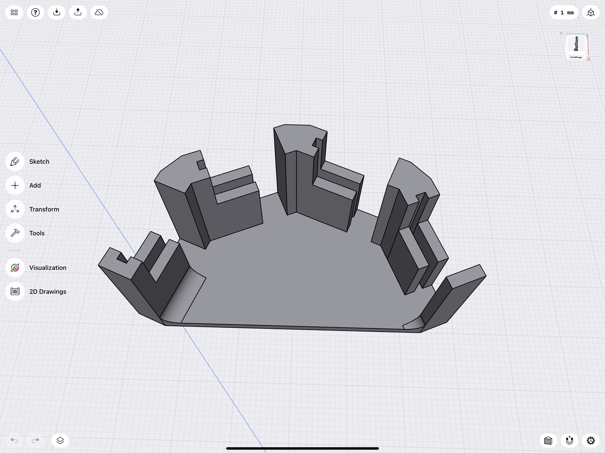

# TOF Sensor: 180° Field of View
Initial design for DIY Robotic Sensor w/180° Field of View using 4x VL53L5CX TOF Sensors from STMicroelectronics

![Project Maintenance][maintenance-shield]

[![License][license-shield]](LICENSE)

## Design Files for TOF Sensor: w/180° Field of View

In this Folder you'll find my intial schematics (r0.1) along with my Initial 3D-Printed Bracket Design for holding the 4 TOF sensors at the needed angles.

### Electrical Wiring

This is how I'm envisioning hooking this up. My goal is to reduce wires between the P2 and the Sensor. With this plan there are 3.3V and 5V power and ground, and I2C bus with Interrupt line for the PCF8575 (400KHz) and 2 i2c busses (1MHz, ea.) with two TOF sensors on each bus. This then is 10 wires running between the P2 and the Sensor mechanism. 

If this works (*when I've figured out how to make it work?*) I can envision a smallish PCB with 4x headers for connecting the sensors which contains the PCF8575 and a final header for a 10-conductor cable routing to the P2. In this case, I'll adjust the 3D model to make a place for mounting the PCB, as well.

THis makes B being made which would mount on the printed bracket as well simplifying the overall wiring.

   
  <B>My wiring plan for 4x TOF Sensors with a PCF8575 i2c 16-port I/O Expander Provinding control.</B>

- [Schematic](./Tof180SensorBoard/Tof180Sensor-R0.1.pdf) - my electrical wiring plan

### Bracket for holding 4 TOF Sensors

To get our 180° field of view, we place each of the sensors in their own 45° segment of the full 180°.

This is my initial plan for the bracket holding these sensors in this arrangement:

   
  <B>The bracket for holding 4x Satel boards vertically,  at each 45° position within the 180° field of view.</B>

There will of course be overlap of their views. What kind of interferrence will this cause?  Experimentation will tell...

- [Model File - Mounting Bracket](./Tof180SensorBracket/TOF-V2d.3mf) - 3D Model File (.3mf) ready for slicing then 3D printing

*These are my initial files/plans. I will update them as things change*

---

> If you like my work and/or this has helped you in some way then feel free to help me out for a couple of :coffee:'s or :pizza: slices!
>
>  &nbsp;&nbsp; -OR- &nbsp;&nbsp; [Patreon.com/IronSheep](https://www.patreon.com/IronSheep?fan_landing=true)

---

## Disclaimer and Legal

> *Parallax, Propeller Spin, and the Parallax and Propeller Hat logos* are trademarks of Parallax Inc., dba Parallax Semiconductor
>
> This project is a community project not for commercial use.
>
> This project is in no way affiliated with, authorized, maintained, sponsored or endorsed by *Parallax Inc., dba Parallax Semiconductor* or any of its affiliates or subsidiaries.

---

## License

Copyright © 2022 Iron Sheep Productions, LLC. All rights reserved.

Licensed under the MIT License.

Follow these links for more information:

### [Copyright](copyright) | [License](LICENSE)

[maintenance-shield]: https://img.shields.io/badge/maintainer-stephen%40ironsheep%2ebiz-blue.svg?style=for-the-badge

[license-shield]: https://camo.githubusercontent.com/bc04f96d911ea5f6e3b00e44fc0731ea74c8e1e9/68747470733a2f2f696d672e736869656c64732e696f2f6769746875622f6c6963656e73652f69616e74726963682f746578742d646976696465722d726f772e7376673f7374796c653d666f722d7468652d6261646765
