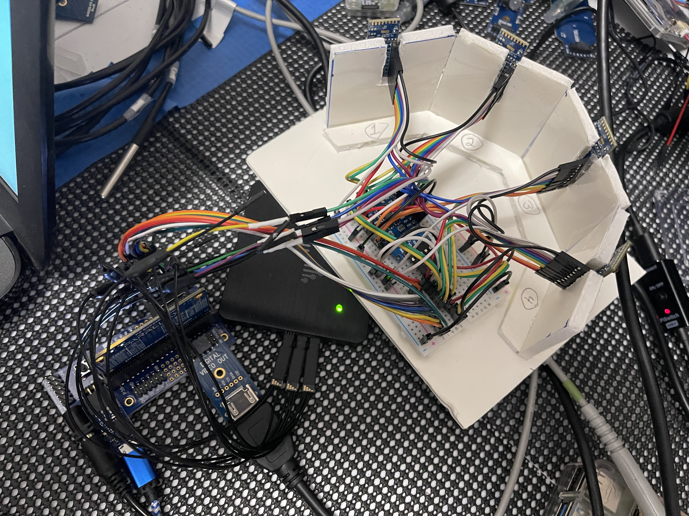
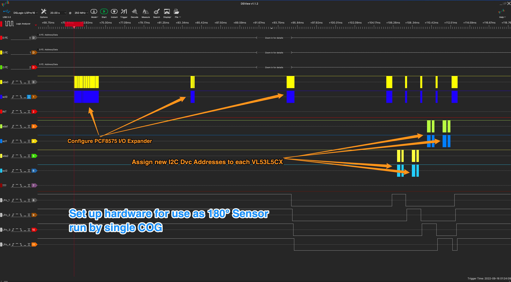
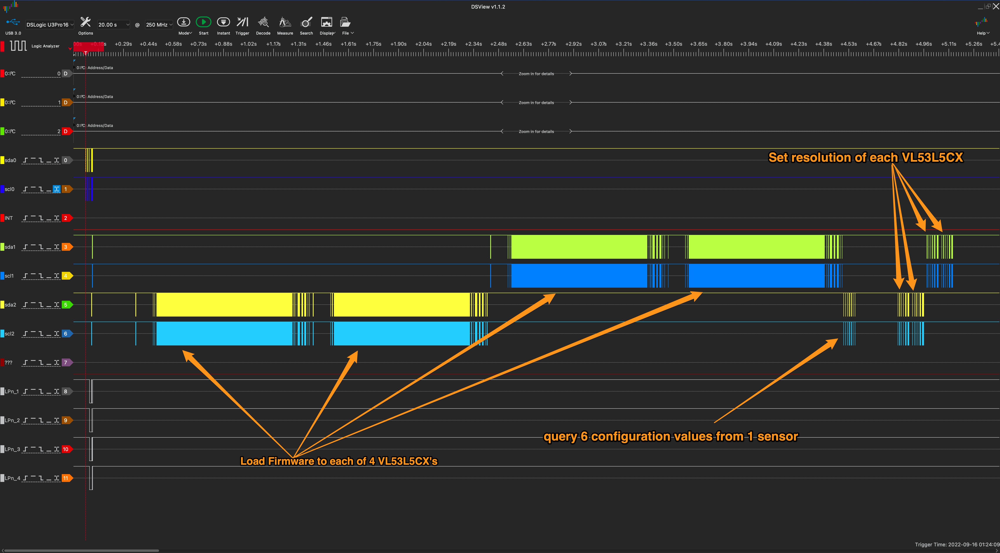
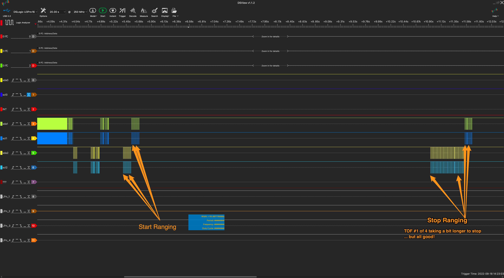
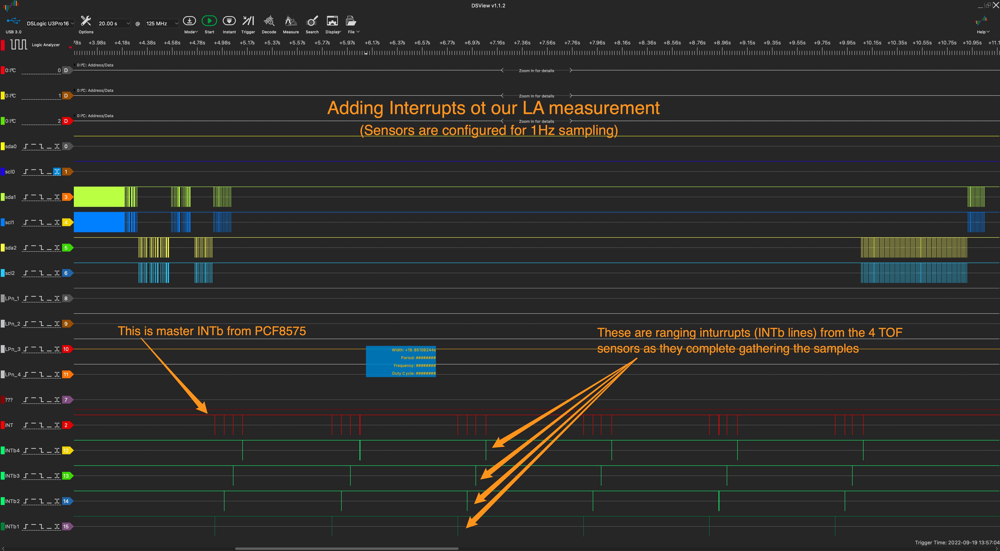
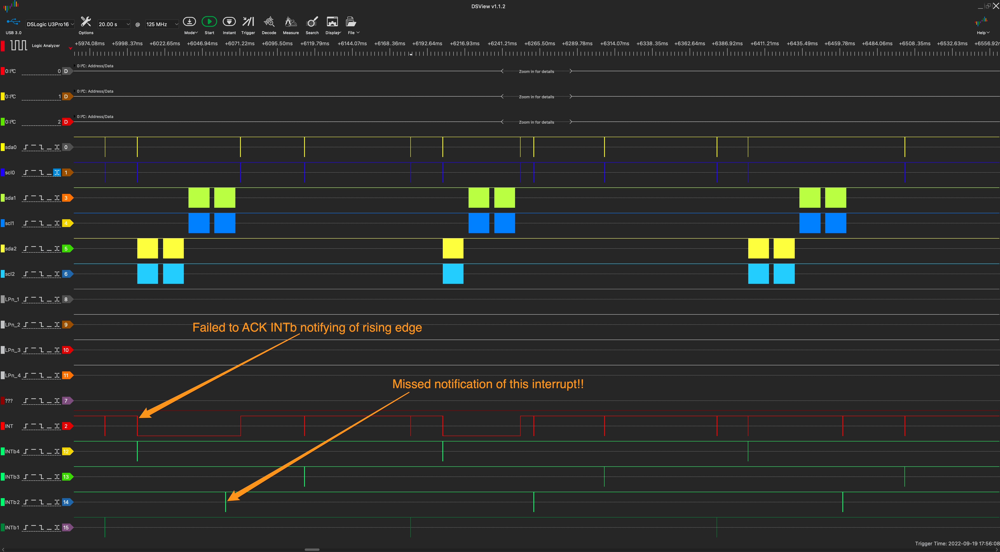
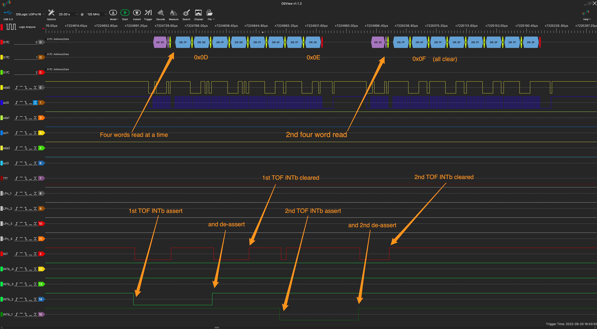
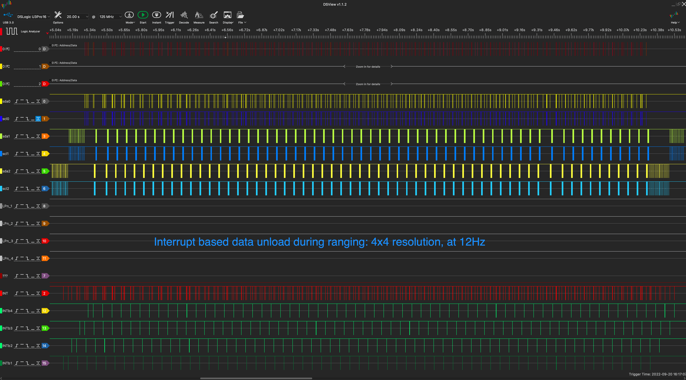
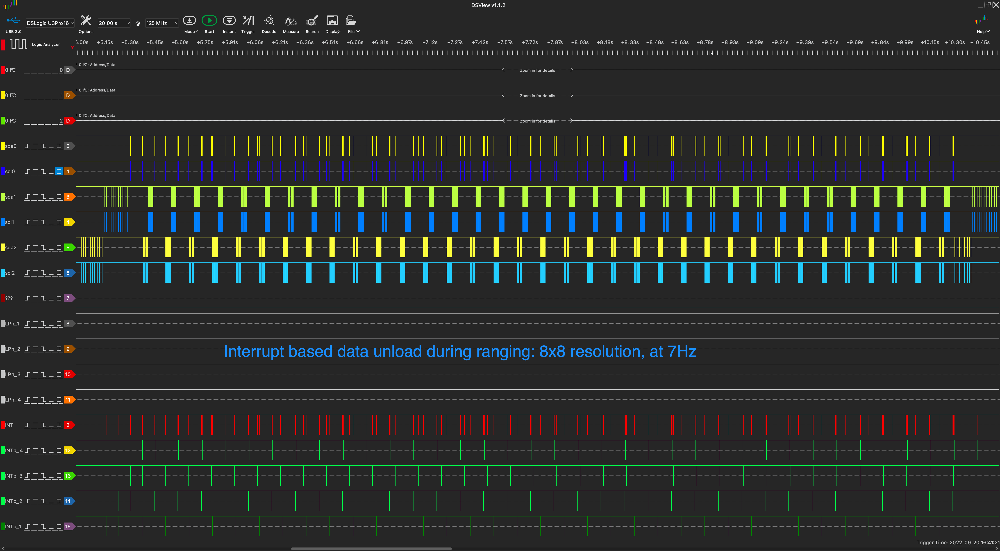

# TOF Sensor: 180° Field of View
Turning on the DIY Robotic Sensor w/180° Field of View using 4x VL53L5CX TOF Sensors from STMicroelectronics and an O2C I/O Expander.

![Project Maintenance][maintenance-shield]

[![License][license-shield]](LICENSE)

## Table of Contents

On this Page:

- [Prototype Hardware](#the-prototype-sensor-hardware)
- [Images - Communications Validation with LA](#logic-analyzers-view-of-chatting-with-the-sensors)

Additional pages:

- [GOAL - TOF Sensor: w/180° Field of View](/DOCs/Designs/README.md) - how I make this wide field-of-view sensor?
- [VL53L5CX Object Documentation](/VL53L5CX.md) - this is our single TOF sensor (actual object) 
- [PCF8575 Object Documentation](/PCF8575.md) - this is used to select between multiple TOF sensors

## The Prototype sensor hardware

To develop the objects for the sensor we needed test hardware. This is the prototype we are using while developing the P2 Objects.

   
  <B>The prototype sensor w/4 Satel boards mounted vertically,  at each 45° position within the 180° field of view. The PCF8575 is under the wires on the plugboard.</B>

## Logic Analyzers' view of chatting with the sensors

As I do when working with any new device I probe the control and status lines of the devices under test with my Logic Analyzer.  This allows me to verify, very accurately, that code is correctly interacting with the device, how and if the device is repsonding and to also verify that I'm interpreting the response values from the device correctly. (e.g., this is how I understand the byte order of data coming from the device.)

### Runtime Configuration 

While I have direct I2C communication with the 4 sensors their control lines are driven by the PCF8575 I/O Expander. So, first we have to configure it and then tell it how to condition its output port bits to enable the 4 sensors. Each of our 4 sensors start up at exactly the same I2C address so then we need to move the devices to their own I2C addreses so we can interact with each individually.

After much code creation and testing here's the proof of this configuration happening:

   
  <B>Here you see the PCF8575 being configured then being used to select the individual sensors so they can each have their own unique I2C bus address.</B>

Whew! So far so good.  Now each of these sensors needs about 80k of code loaded so now that we can talk to each of them, we load their code. After each is loaded, we can then talk to the now running code. The first thing we do is query the first sensor for its default configuration values.  This tells us how each is currently set up (since they were all loaded with the same code.

Next we need to reconfigure the sensors so we can start them all ranging in the mode that we wish to use.

Here's the proof that this is all happening as expected:

   
  <B>After we can address the 4 sensors we can now load firmware into each and then configure the ranging settings we want to use. Just before configuring the sensors, we query one of them to get all 6 default configuration values.</B>

### Turning on Ranging

Now since this is all about ranging let's get Ranging working:

   
  <B>Here we see the start and stop ranging commands working! Note the behavior of the 1st sensor when stopping.</B>

In this case the code sent the start ranging command, let it run for ~5 seconds and then sent the stop ranging command to each of them. You'll notice the stop-ranging has polling built in beause a sensor can take time to stop (as we see in the case of the first sensor as inicated in the image.).

So, now that we know we can start and stop the sensors let's figure out unloading of data. We have two choices: (1) we can poll the devices to determine when each device has data to unload (*hmmm... this would be a lot of i2c bus traffic...*) or (2) we can unload when we are told we can by listening to the interrupts.  Ok, but how do our interrupts behave?

It's time to adjust our Logic Analyzer setup again as we add probing of the interrupts pins...

So, this was interesting... at first look, the interrupt signalling the LA saw didn't look right! I found some relavent hardware notes in the datasheets:

1. VL53L5CX INTb (active low) is open-drain output (tristate) requiring a 47k ohm pullup resistor to IOVDD (3.3v)
2.  PCF8575 INTb (active low) is also open-drain. (No mention of pullup requirement)

It turns out that I had to add a 47k pull-up to the PCF8575 INTb pin to get stable values from the pin.  I updated the sensor schematic with the 5 47k pullup resistors (now r1.0) but it turns out the INTb lines from the VL53L5CX to the PCF8575 don't appear to need them. (*So mental note: if I build a board for this I'll leave the 4 TOF pullup pads in the layout but not initially populate them.  This way, if we later find they are useful, we can populate them*)

With pull-up resistor added to the prototype, here's what I'm now seeing for the same command sequence: start ranging, wait for 5 secs, then stop ranging:

   
  <B>New instrumentation: now watching the INTb pins going into the PCF8575 (green traces) and the INTb pin coming out of the PCF857, into the P2 (red trace above the green ones.)</B>

The interrupts are working now, how are we going to have to respond to them? We see groups of 4 interrupts occurring about 1 second apart. This is our four sensors asked to range at once per second (at 1 Hz). They individually report as each comes ready and they are reporting in the same order that they were asked to start ranging. We also see that the VL53L5CX devices assert their interupt for only 100 uSec. We also see that the PCF8575 device is also only holding the interrupt present for the same amount of time.  So, we need a fast mechanism that will detect and then record the fact that a device has interrupted. This should run at a fast enough rate so that we don't miss interrupts when ranging at the highest frequency we want to support (device capabilities: 1-15 Hz at 8x8, 1-60Hz at 4x4.) My goal will be to measure what frequencies we can support in this configuration with the P2.

### Unloading based on interrupt notification

So I initially turn on interupts by waiting for the PCF8575 INTb line to be asserted, then ask it for the 16-bit word that represents the state of all 16 I/O pins. Four of these (8-11) are our interrupt bits.  We know that the PCF8575 is somewhat unusual in that it will assert INTb for either falling or rising edges. So we need software to filter-out the rising edge notifications since we only care about falling edges.  Every time we issue a read to the PCF8575 we acknowledge the interrupt and the INTb line is de-asserted. So as soon as I turn on this first part I get a new behavior.  That is: A TOF sensor asserts INTb, the PCF8575 sees it and asserts its own INTb, we read the port bits (to see which it was) whcih clears the interrupt and voila another interrupt is asserted!  Yep, this is our rising edge of the TOF sensor line.  If we don't also acknowledge this as well, this assertion can block our being notified of new interrupts as seen here:

   
  <B>BUG: Missing notification of new interrupt due to NOT clearing the rising edge interrupt</B>

The next issue I encountered was the individual byte reads over I2C were are slower than block reads so we have a lower limit on the imterrupt rate we can respond too.  By reading the port bits with a much smaller gap in time between bytes we can service intrrupts which are closer together. Of course there is a practical limit to this hardware (PCF8575 fronting for our VL53L5CX's) which we can't exceed. But let's do our best!  

It turns out that two things can benefit us here. (1) if we do block-reads then we have the smallest gap between bytes read and (2) if we read more than 16bits from the PCF8575 it just wraps around and gives us the same bytes again. So we can ask for a word read and get our 16 bits. We can ask for 2 word reads and the the same 16 bits read twice much more rapidly than if we asked for two single-word reads since they are now a single I2C read-block transaction.  

So, I studied at our timing. Single interrupts at 100 uSec assertion can be read and cleared by doing a 4-word read (read the 16 bits. 4 times.)  This is a big win! single I2C transaction reads and clears both edges! But, there is one more enhancement. Occasionally a 2nd interrupt can get really close so, in the 4 word read case, the 4th word can end up being a new TOF INTb assertion. So, easy, we watch for this unusual case and do another 4 word read if the word was an interrupt to get and clear any more notifications.  It turns out that this change in acknowleging interrupts is sufficient enough to go from 3-Hz to 7-HZ ranging frequency with our 180° sensor!  A big win!  Here's this new INTb ack with 2nd read in action:

   
  <B>FIXED: New 4-word read mechanism for acknowledging interrupts</B>

**NOTE:** the interrupt service routine code returns all new assertions seen with each 4-word read. If it does a 2nd 4-word read it returns all found in that as well. The routine also recognizes multiple bit assertions within each word.  We don't miss much with this new mechanism.  ;-)

### Measuring Performance of new INT based unloads

Ok, now that this is all working I took time to experiment with how fast we can run (what sampling frequency can we sustain wiht out missing unloads) at each of our two resolutions (4x4 and 8x8)  Ti turns out the we now can do:

- Full 180° frame unloads: 4x4 resolution at 12 Hz (12 full frames every second) - A new frame every  83 mSec.!
- Full 180° frame unloads: 8x8 resolution at 7 Hz (7 full frames every second) - A new frame every 143 mSec.!

And here's what the sytem looks like for each:

   
  <B>FINAL: interrupt-based unloads of 4x4 resolution at 12 Hz</B>

   
  <B>FINAL: interrupt-based unloads of 8x8 resolution at 7 Hz</B>

There you are! We have working proven hardware and code with good verification by using our Logic Analyzer to see all the signalling between our prototype hardware and the P2.

### Turned on, what's next?

Ok, well, this is it for turning on the hardware.  Next i'm on to getting full visualizing of the sensed data on our HDMI display. Then lastly, I'll be adding routines to provide a list of blocked path areas from the sensed data so this code can be somting we integrate on our robot patforms very easily.

So... watch for the appearance of an upcoming viualization page where I describe the my efforts of characterizing our full 180° Field of View Time-of-Flight sensor.

---

> If you like my work and/or this has helped you in some way then feel free to help me out for a couple of :coffee:'s or :pizza: slices!
>
>  &nbsp;&nbsp; -OR- &nbsp;&nbsp; [Patreon.com/IronSheep](https://www.patreon.com/IronSheep?fan_landing=true)

---

## Disclaimer and Legal

> *Parallax, Propeller Spin, and the Parallax and Propeller Hat logos* are trademarks of Parallax Inc., dba Parallax Semiconductor
>
> This project is a community project not for commercial use.
>
> This project is in no way affiliated with, authorized, maintained, sponsored or endorsed by *Parallax Inc., dba Parallax Semiconductor* or any of its affiliates or subsidiaries.

---

## License

Copyright © 2022 Iron Sheep Productions, LLC. All rights reserved.

Licensed under the MIT License.

Follow these links for more information:

### [Copyright](/copyright) | [License](/LICENSE)

[maintenance-shield]: https://img.shields.io/badge/maintainer-stephen%40ironsheep%2ebiz-blue.svg?style=for-the-badge

[license-shield]: https://camo.githubusercontent.com/bc04f96d911ea5f6e3b00e44fc0731ea74c8e1e9/68747470733a2f2f696d672e736869656c64732e696f2f6769746875622f6c6963656e73652f69616e74726963682f746578742d646976696465722d726f772e7376673f7374796c653d666f722d7468652d6261646765
