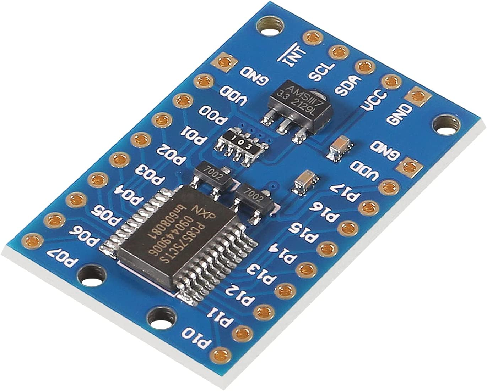

# P2 PCF8575 - I2C I/O port Expander Driver

Interacting with the PCF8575 I/O port expander from our P2

![Project Maintenance][maintenance-shield]

[![License][license-shield]](LICENSE)

## PCF8575 - I2C I/O port expander 

The PCF8575 is a silicon CMOS circuit. It provides general purpose remote I/O expansion via the two-line bidirectional bus (I2C-bus).

The device consists of a 16-bit quasi-bidirectional port and an I2C-bus interface. The PCF8575 has a low current consumption and includes latched outputs with high current drive capability for directly driving LEDs. It also possesses an interrupt line (INT) which can be connected to the interrupt logic of the microcontroller. By sending an interrupt signal on this line, the remote I/O can inform the microcontroller if there is incoming data on its ports without having to communicate via the I2C-bus. This means that the PCF8575 is an I2C-bus slave transmitter/receiver.

<p align="center">
  <br>
  <B>Shown: The PCF8575 Breakout Board</B>
</p>

### Purchase

The PCF8575 is available in a number of forms from a number of sources:

- [Amazon](https://www.amazon.com/ACEIRMC-PCF8575-Expander-Extension-Arduino/dp/B09DFWS722) - as shown, 3pk, (*also, search for part number as there are other forms available.*)


### Driver Features

This driver object provides direct bit access to all 16 PCF8575 single bit ports as well as an upper layer providing individual bit direction controls along with bit set/get access methods.  The driver communicates with the PCF8575 using the I2c protocol clocked at 400KHz.

### Timings

| Activity | Description |
| --- | --- |
| consecutive port reads | All 16 input lines can be repeatedly read at 17.9 KHz (or every 55.644 uSec.)
| consecutive port writes | All 16 output lines can be toggled at 1.87 KHz (or every ~535 uSec.)

### Driver Interface

| Method Name | Description |
| --- | --- |
| | **-- General Setup --** 
| start(pinSCL, pinSDA, pinINT) : bDevicePresent | Start the device running
| deviceID() : eDevice | Return indication (enum value) of if and which device we found on i2c bus
| stop() | Stop our i2c bus use and float all pins
| | **-- Bit Direction Control Synthesis --** 
| setBitDirection(bitNbr, eDirection) | Set output bit direction (eDirection, bits are 0-15)<BR>Where eDirection = BIT_IS_INPUT or BIT_IS_OUTPUT
| setOutputBitValue(bitNbr, bitValue) | Set output bit value (0 or 1, bits are 0-15)
| getInputBitValue(bitNbr) : nBitValue | Return [0,1] the value of the desired input bit (0-15)
| getInputBits() : nWordValue |  Return word that is all bits read from device<BR>  NOTE: Output bits are zero'd
| getInputBitsNTimes(pWordPtr, nWordCount) | Read all 16 port pin values from device {nWordCount} times consecutively, all 16 port pin values, from device - placing them into WORD array located at {pWordPtr}<BR> NOTE: Each value has output bits zero'd
| toggleOutputBit(bitNbr) | Toggle the output bit value (bits are 0-15)
| isOutputBit(bitNbr) : bIsOutput | Return T/F where T means numbered bit is set to output!
| | **-- Device Reads and Writes --** 
| getIntPinState() : bPinState | Return interpreted value of Interrupt pin where 1 = TRUE, 0 = FALSE
| readWord() : bStatusOK, result16 |  Read {result16}, all 16 port pin values, from device Returning both:<BR>{bStatusOK} - T/F where TRUE = SUCCESS and<BR> {result16} - the WORD value read from the device
| writeWord(dataValue16) : bStatusOK |  Write {dataValue16} to our 16 port pins<BR>Returns {bStatusOK} - T/F where TRUE = SUCCESS
| readWords(pWordPointer, nWordCount) : bStatusOK | Read all 16 port pin values from device {nWordCount} times consecutively, all 16 port pin values, from device - placing them into WORD array located at {pWordPointer}<BR>Returns {bStatusOK} - T/F where TRUE = SUCCESS


### Files

| Filename | Description |
| --- | --- |
| demo_pcf8575.spin2 | Top level demo file |
| isp_pcf8575.spin2 | The P2 driver (uses underlying i2c driver (jm_i2c.spin2) |

### Demo Configuration

As written the demo assigned the following pins to communicate with the board. 

| P2 PIN | Board Connector | Purpose | Direction
| --- | ---| ---| ---|
| 26 | SDA | data| In/Out
| 25 | SCL | clock| Out
| 24 | INT | interrupt | In


Of course you can adjust these assignments. Adjust the follwing constants within the file `demo_pcf8575.spin2` to your liking:

```
    PIN_PCF8575_SCL     = 25
    PIN_PCF8575_SDA     = 26
    PIN_PCF8575_INT     = 24
```


---

> If you like my work and/or this has helped you in some way then feel free to help me out for a couple of :coffee:'s or :pizza: slices!
>
> [](https://www.buymeacoffee.com/ironsheep) &nbsp;&nbsp; -OR- &nbsp;&nbsp; [](https://www.patreon.com/IronSheep?fan_landing=true)[Patreon.com/IronSheep](https://www.patreon.com/IronSheep?fan_landing=true)

---

## Disclaimer and Legal

> *Parallax, Propeller Spin, and the Parallax and Propeller Hat logos* are trademarks of Parallax Inc., dba Parallax Semiconductor
>
> This project is a community project not for commercial use.
>
> This project is in no way affiliated with, authorized, maintained, sponsored or endorsed by *Parallax Inc., dba Parallax Semiconductor* or any of its affiliates or subsidiaries.

---

## License

Copyright © 2022 Iron Sheep Productions, LLC. All rights reserved.

Licensed under the MIT License.

Follow these links for more information:

### [Copyright](copyright) | [License](LICENSE)

[maintenance-shield]: https://img.shields.io/badge/maintainer-stephen%40ironsheep%2ebiz-blue.svg?style=for-the-badge

[license-shield]: https://camo.githubusercontent.com/bc04f96d911ea5f6e3b00e44fc0731ea74c8e1e9/68747470733a2f2f696d672e736869656c64732e696f2f6769746875622f6c6963656e73652f69616e74726963682f746578742d646976696465722d726f772e7376673f7374796c653d666f722d7468652d6261646765
