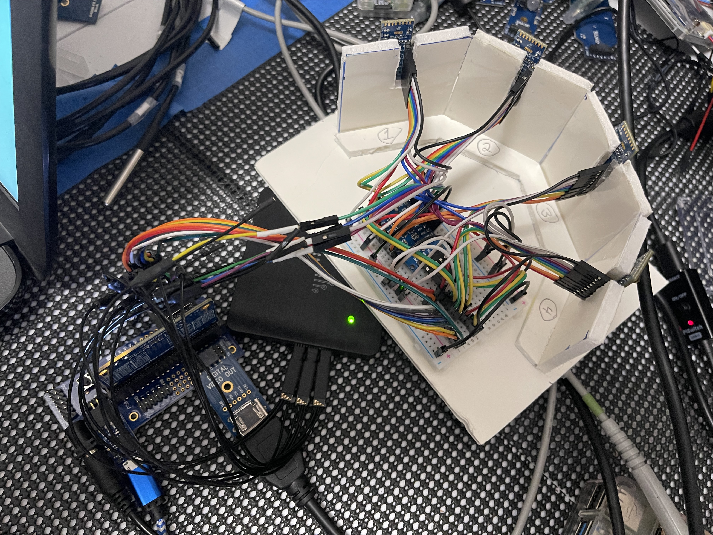

# P2-VL53L5CX-time-of-flight-driver and more...
This project describes creating a 180° Field of View time-of-flight sensor by ganging 4 VL53L5CX TOF sensors in 45 degree fields to form a single 180 degree sensor. Additonally, we use a PCV8575 I2C I/O Expander to handle most of the I/O with the 4 sensors thus reducing the number of pins needed to drive the sensor complex from the P2.

This project contributes 3 objects to our P2 community:

1. The [PCF8575 I/O Expander object](./PCF8575.md)
2. The [VL53L5CX TOF Sensor object](./VL53L5CX.md)
3. And lastly, the overall control object for the 180° Field of View time-of-flight sensor

![Project Maintenance][maintenance-shield]

[![License][license-shield]](LICENSE)

## VL53L5CX Time-of-Flight Sensor 
(*...Excerpt from [STMicroelectronics webpage](https://www.st.com/en/imaging-and-photonics-solutions/vl53l5cx.html)*)

The VL53L5CX is a state of the art, Time-of-Flight (ToF), multizone ranging sensor. It integrates a SPAD array, physical infrared filters, and diffractive optical elements (DOE) to achieve the best ranging performance in various ambient lighting conditions with a range of cover glass materials. The use of a DOE above the vertical cavity surface emitting laser (VCSEL) allows a square FoV to be projected onto the scene. The reflection of this light is focused by the receiver lens onto a SPAD array.

Unlike conventional IR sensors, the VL53L5CX allows absolute distance measurement whatever the target color and reflectance. It provides accurate ranging up to 400 cm and can work at fast speeds (60 Hz).

Multizone distance measurements are possible up to 8x8 zones with a wide 63° diagonal FoV which can be reduced by software. The VL53L5CX is able to detect different objects within the FoV.

## The 180° Field of View time-of-flight sensor prototype

Our idea was that we could create a non-moving sensor with 180° field of view with full sensing at multiple frames per second (where frame is the entire visbile field as seen by the full set of sensors.)  As fast as this is (full resolution at 7 full frames per second.) it could make a really fun sensor for rebotic use. Our goal is to see how few P2 resources we could consume (pins, cogs) while still providing a very performant sensor.

Here is the prototype hardware we used while developing the objects for this sensor:

<p align="center">
  <br>
  <B>The prototype sensor w/4 Satel boards mounted vertically, </br>at each 45° position within the 180 field of view. The PCF8575 is under the wires on the plugboard.</B>
</p>

All of our performance measurements are backed up with measurements taken with a Logic Analyzer.  We use the [DSLogic U3Pro16](https://www.dreamsourcelab.com/product/dslogic-series/) usb attached device. *You can see it partially colovered by the sensor body in the picture above. It has the green LED.*


## Table of Contents

On this Page:

- [Driver Features](#features)
- [The sensor object](#the-180-fov-tof-sensor-object-spin2)
- [Using the sensor in your own Project](#using-the-180-fov-tof-sensor-object-in-your-own-project)
- [How to contribute](#how-to-contribute)

Additional pages:

- [GOAL - TOF Sensor: w/180° Field of View](./DOCs/Designs/README.md) - how I make this wide field-of-view sensor?
- [VL53L5CX Sensor Documentation](./DOCs) - PDFs about the sensor itself
- [VL53L5CX Object Documentation](./VL53L5CX.md) - this is our TOF sensor (actual object) 
- [PCF8575 Object Documentation](./PCF8575.md) - this is used to select between multiple TOF sensors

## P2 Driver for the 180° Field of View Time-of-Flight sensor

### Features

As of this writing the features of this sensor drvier are:

- Uses 1 COG for communication with the 4x Satel boards and the PCF8575.
- Uses 6 pins for I2C (could be reduced to 4) and 1 pin for sensing interrupts from the PCF8575
- Maintains in-HUB RAM image of all sensor data (4 sets of data, 1 for ea. TOF sensor)
- Full 180° frame unloads: 4x4 resolution at 12 Hz (12 full frames every second, a new frame every  83 mSec.)
- Full 180° frame unloads: 8x8 resolution at 7 Hz (7 full frames every second, a new frame every 143 mSec.!)

Planned Enhacement:

- in-RAM ist of targets seen by direction (0-179°) and distance [2 to 400 cm]

## Current status

Latest Changes:

```
20 Sep 2022
- New interrupt acknowledge mechanism gives us greater speed for both 8x8 and 4x4 operation
19 Sep 2022
- Interrupt-based unloads are now working correctly for 8x8 resolution
18 Sep 2022
- Start and Stop ranging now working correctly for all 4 sensors
16 Sep 2022
- All four devices now loading code and communicating correctly
10 Sep 2022
- Full data arriving from TOF sensor correctly!
- Working on HDMI display of 4 sensors at once
6 Sep 2022
- All public methods converted, now in midst of turning on ranging...
- Code starting to take shape
5 Sep 2022
- Started porting unload and overall ranging control code
4 Sep 2022
- Firmware upload to VL53L5CX MCU is tested and working
24 Aug 2022
- Driver for i2c I/O port expander tested and working, has its own demo
20 Aug 2022
- Project started
```

## Known Issues

Things we know about that still need attention:

```
- Driver is not making use of: optional features of VL53L5CX part: xtalk calibration, motion indication, or configurable detection threasholds
```


## The 180° FOV TOF sensor object (.spin2)

### Timings

This driver has been measured to perform as follows:

- Full 180° frame unloads: 4x4 resolution at 12 Hz (12 full frames every second, a new frame every  83 mSec.)
- Full 180° frame unloads: 8x8 resolution at 7 Hz (7 full frames every second, a new frame every 143 mSec.!)

### Driver Interface


The programming interface to this driver is as follows:

| Method Name | Description |
| --- | --- |
| --------- | **-- General Setup --** 
| setHDMIBasePin(pHDMIbase) | Assign pins to HDMI Eval Adapter
| setTofPins(nBusNbr, pSDA, pSCL) | Assign pins to I2C Bus #[0-1]</br>(we have two TOF sensors on each I2C bus)
| setExpanderPins(pSDA, pSCL, pinINT) |  Assign pins to I2C bus for our PCF8575 I/O Expander</br>this listens to and controls all 4 TOF sensors
|  start() : Ok | Start all backend objects and our Overall driver Cog
| stop() |  Stop our driver-Cog and all backend objects
| --------- | **-- Control --** 
| setParameter(nParmId, nParmValue) : nResponse | set value for given parameter name
| getParameter(nParmId) : nResponse, nParmValue | Get current Value for given parameter name
| enableRanging(bEnable) : nResponse | Enable(TRUE) or Disable(false) ranging
| isRanging() : bRangingStatus |  Return T/F where T means one or more sensors are ranging</br> (hopefully, all four since we run them as a set! ;-)
| --------- | **-- Sensed Data Access --** 
| *-- TBA --*

### Files

This driver has its own top-level demo. The files involved are:

| Filename | Description |
| --- | --- |
| demo\_180degrFOV.spin2 | Top level demo file |
| isp\_180degrFOV_TOFsensor.spin2 | The P2 Object |
|  --------- | **-- Underlying Files--** |
| isp_vl53l5cx.spin2 | The VL53L5CX P2 Object |
| vl53l5cx\_mm1\_1_fw.dat | part of the firmware loaded into the TOF sensors |
| isp_i2c.spin2 | Underlying i2c driver  tuned for VL53L5CX 1Mbit xfers |
| isp_pcf8575.spin2 | The PCF8575 P2 Object |
| isp_i2c.spin2 | Underlying standard i2c driver |
|  --------- | **-- HDMI Files--** |
| isp\_hdmi_debug.spin2 | HDMI Display manager for Monitoring the 4 x TOF sensors |
| p2videodrv.spin2 | VGA/DVI/TV graphics and text mode video driver 
| p2textdrv.spin2 | VGA/DVI text mode interface for video driver 
| p2font16 | fonts for HDMI


### Demo Configuration

As written the demo assigned the following pins to communicate with the board. 

| P2 PIN(s) | Board Connector | Purpose | Direction
| --- | ---| ---| ---|
| | **-- HDMI --**
| 8-15 | DVI Eval Board | | In/Out
| | **-- PCF8575 --**
| 16 | SDA0 | data| In/Out
| 17 | SCL0 | clock| In
| 18 | INT | interrupt | In
| | **-- TOF 1 and 2 --**
| 19 | SDA1 | data| In/Out
| 20 | SCL1 | clock| In
| | **-- TOF 3 and 4 --**
| 21 | SDA2 | data| In/Out
| 22 | SCL2 | clock| In

**NOTE:** *Now that this is running and we know the limits/capabilites the two I2C busses used for comms with the VL53L5Cx parts could be a single I2C bus with no loss in function*

Of course you can adjust these assignments. Adjust the follwing constants within the file `demo_vl53l5cx.spin2` to your liking:

```
    PIN_HDMI_BASE = 8

    PIN_PCF8575_SDA0    = 16
    PIN_PCF8575_SCL0    = 17
    PIN_PCF8575_INT     = 18

    PIN_VL75L5CX_SDA1   = 19
    PIN_VL75L5CX_SCL1   = 20

    PIN_VL75L5CX_SDA2   = 21
    PIN_VL75L5CX_SCL2   = 22

```

## Using the 180° FOV TOF sensor object in your own project

By adding a couple of lines to your project you can use this sensor.

First include the new sensor object:

```
OBJ { our sensors }

    tofSensor   : "isp_180degrFOV_TOFsensor"      ' our sensor

```

Now tell the sensor what pins it is plugged into:

```
    ' configure the 180° sensor pins and HDMI display BASE-PIN
    tofSensor.setHDMIBasePin(PIN_HDMI_BASE)
    tofSensor.setExpanderPins(PIN_PCF8575_SDA0, PIN_PCF8575_SCL0, PIN_PCF8575_INT)
    tofSensor.setTofPins(1, PIN_VL75L5CX_SDA1, PIN_VL75L5CX_SCL1)
    tofSensor.setTofPins(2, PIN_VL75L5CX_SDA2, PIN_VL75L5CX_SCL2)
```

**NOTE:** this is different from most P2 objects in that the 180° sensor needs to set up it's underlying objects so it needs a bit more detail.

Next, start the sensor. This moves all the TOF sensors to thier own i2c addresses and then loads code into each:

```
    ' now start the drivers, Init the sensors
    tofSensor.start()
```

Let's configure the sensor:

```
    drvrResponse := tofSensor.setParameter(tofSensor.PID_RESOLUTION, tofSensor.VL53L5CX_RESOLUTION_4x4)
    ' if configure went OK
    if drvrResponse == tofSensor.DRVR_CMD_OK
        drvrResponse := tofSensor.setParameter(tofSensor.PID_RANGING_FREQUENCY, 13)
        ' if configure went OK
        if drvrResponse == tofSensor.DRVR_CMD_OK
            ...
```

And start it ranging, stopping it after 5 seconds (just to show how we do this)

```
            debug("* Let's range!")
            ' let's start ranging!
            drvrResponse := tofSensor.enableRanging(TRUE)
            if drvrResponse == tofSensor.DRVR_CMD_OK

                ' run for 5 seconds
                waitms(5 * 1000)   ' test 5 sec only

                if tofSensor.isRanging()
                    debug("* Stop ranging")
                    ' let's stop ranging!
                    tofSensor.enableRanging(FALSE)

```

And that's all there is to it!  Enjoy!

## How to Contribute

This is a project supporting our P2 Development Community. Please feel free to contribute to this project. You can contribute in the following ways:

- File **Feature Requests** or **Issues** (describing things you are seeing while using our code) at the [Project Issue Tracking Page](https://github.com/ironsheep/P2-VL53L5CX-time-of-flight-driver/issues)
- Fork this repo and then add your code to it. Finally, create a Pull Request to contribute your code back to this repository for inclusion with the projects code. See [CONTRIBUTING](CONTRIBUTING.md)

---

> If you like my work and/or this has helped you in some way then feel free to help me out for a couple of :coffee:'s or :pizza: slices!
>
> [](https://www.buymeacoffee.com/ironsheep) &nbsp;&nbsp; -OR- &nbsp;&nbsp; [](https://www.patreon.com/IronSheep?fan_landing=true)[Patreon.com/IronSheep](https://www.patreon.com/IronSheep?fan_landing=true)

---

## Disclaimer and Legal

> *Parallax, Propeller Spin, and the Parallax and Propeller Hat logos* are trademarks of Parallax Inc., dba Parallax Semiconductor
>
> This project is a community project not for commercial use.
>
> This project is in no way affiliated with, authorized, maintained, sponsored or endorsed by *Parallax Inc., dba Parallax Semiconductor* or any of its affiliates or subsidiaries.

---

## License

Copyright © 2022 Iron Sheep Productions, LLC. All rights reserved.

Licensed under the MIT License.

Follow these links for more information:

### [Copyright](copyright) | [License](LICENSE)

[maintenance-shield]: https://img.shields.io/badge/maintainer-stephen%40ironsheep%2ebiz-blue.svg?style=for-the-badge

[license-shield]: https://camo.githubusercontent.com/bc04f96d911ea5f6e3b00e44fc0731ea74c8e1e9/68747470733a2f2f696d672e736869656c64732e696f2f6769746875622f6c6963656e73652f69616e74726963682f746578742d646976696465722d726f772e7376673f7374796c653d666f722d7468652d6261646765
