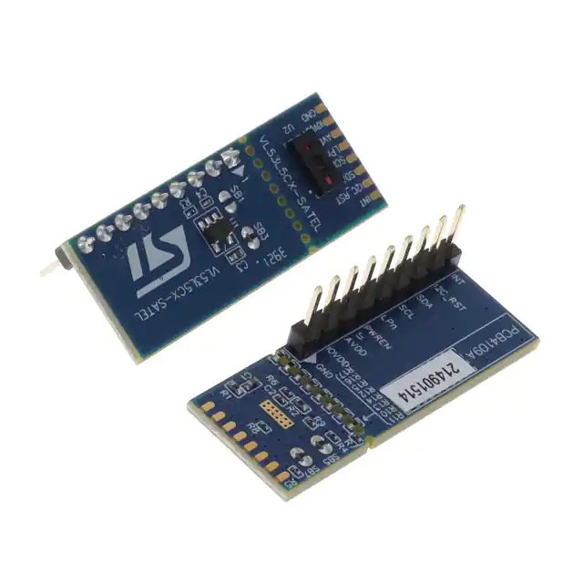

# P2 VL53L5CX Object - Time-of-Flight Sensor
Interacting with the VL53L5CX Time-of-Flight Sensor from our P2

![Project Maintenance][maintenance-shield]

[![License][license-shield]](LICENSE)

## VL53L5CX Time-of-Flight Sensor 
(*...Excerpt from [STMicroelectronics webpage](https://www.st.com/en/imaging-and-photonics-solutions/vl53l5cx.html)*)

The VL53L5CX is a state of the art, Time-of-Flight (ToF), multizone ranging sensor. It integrates a SPAD array, physical infrared filters, and diffractive optical elements (DOE) to achieve the best ranging performance in various ambient lighting conditions with a range of cover glass materials. The use of a DOE above the vertical cavity surface emitting laser (VCSEL) allows a square FoV to be projected onto the scene. The reflection of this light is focused by the receiver lens onto a SPAD array.

Unlike conventional IR sensors, the VL53L5CX allows absolute distance measurement whatever the target color and reflectance. It provides accurate ranging up to 400 cm and can work at fast speeds (60 Hz).

Multizone distance measurements are possible up to 8x8 zones with a wide 63° diagonal FoV which can be reduced by software. The VL53L5CX is able to detect different objects within the FoV.

<p align="center">
  <br>
  <B>Shown: The Satel Breakout Board package</B>
</p>

### Purchase

This sensor is available in a number of forms from a number of sources:

- [DigiKey](https://www.digikey.com/en/product-highlight/s/stmicroelectronics/vl53l5cx-time-of-flight-ranging-sensor) - Satel breakout, plus other forms
- [Mouser](https://www.mouser.com/new/stmicroelectronics/stm-vl53l5cx-tof-sensor/) - Satel breakout, plus other forms
- [Pololu](https://www.pololu.com/product/3417) - carrier board + voltage regulator
- [sparkfun](https://www.sparkfun.com/products/18642) - carrier board w/QWIIC interface


## Table of Contents

On this Page:

- [The vl53l5cx Object](#the-vl53l5cx-object-spin2)
- [Use the vl53l5cx object in your own Project](#using-the-vl53l5cx-object-in-your-own-project)

Additional pages:

- [VL53L5CX part](./DOCs/vl53l5cx.pdf) datasheet
- [VL53L5CX Satel board](./DOCs/vl53l5cx-satel.pdf) datasheet
- [VL53L5CX driver](./DOCs/um2884-use-vl53l5cx-with-ultra-lite-driver-sw.pdf) windows driver notes but mostly useful with this driver/object too
- [GOAL - TOF Sensor: w/180° Field of View](./DOCs/Designs/README.md) - how I make this wide field-of-view sensor?
- [PCF8575 Object Documentation](./PCF8575.md) - this is used to select between multiple TOF sensors

## Current status

Latest Changes:

```
10 Sep 2022
- Full data arriving from TOF sensor correctly!
6 Sep 2022
- All public methods converted, now in midst of turning on ranging...
- Code starting to take shape
5 Sep 2022
- Started porting unload and overall ranging control code
4 Sep 2022
- Firmware upload to VL53L5CX MCU is tested and working
20 Aug 2022
- Project started
```

## Known Issues

Things we know about that still need attention:

```
- Optional features not yet implemented:
 -- xtalk calibration
 -- motion indicator
 -- detection thresholds

```
## The VL53L5CX object (.spin2)

### Features

This driver object provides 

### Timings

This driver has been measured using a logic analyzer and is currently achieving the following:

| Activity | Description |
| --- | --- |
| TBA

### Driver Interface

The programming interface to this driver is as follows:

| Method Name | Description |
| --- | --- |
| | **-- General Setup --** 
| start(pinINT, pinRST, pinSDA, pinSCL, pinLPN, pinPWREN) : bDevicePresent | Start the device running
| stop() | Stop our i2c bus use and float all pins
| isAlive() : eDvcStatus, bIsAlive | Returns {bIsAlive} when {eDvcStatus} == VL53L5CX\_STATUS\_OK</br>{bIsAlive} contains T/F (where T means the device was found on the i2c bus)</br>Alternatively returns {eDvcStatus}:</br>VL53L5CX\_STATUS\_ERROR - if there was an I2C communications error
| setI2CAddress(i2cAddress) : eDvcStatus |Reconfigure device to respond to new i2c device address</br> Returns VL53L5CX_STATUS_OK if the sensor's address was correctly changed or VL53L5CX_STATUS_ERROR otherwise.
| getI2CAddress() : nDvcI2CAddr |Return the current i2c device address (or DVC\_NOT\_FOUND if no device found on i2c bus)
| | **-- Alternate Muli-Sensor Setup --** 
| setPinsAndID(pSDA, pSCL, nID) : ok |Record PINs for later Deferred Start [startUsingPins()] for use by driver cog
| startUsingPins() : bDevicePresent | Deferred Start for use by driver cog</br>MUST be preceed by setPins()
| activateSensor() : bDevicePresent |  Deferred Start for use by driver cog   MUST be preceed by setPins() and startUsingPins()
| | **-- Configuration --** 
| setRangingFrequencyHz(newFrequency8) : eDvcStatus
| getRangingFrequencyHz() : eDvcStatus, frequencyHz8
| setRangingMode(eRangingMode) : eDvcStatus
| getRangingMode() : eDvcStatus, eRangingMode
| setResolution(eResolution) : eDvcStatus
| getResolution() : eDvcStatus, eResolution
| setPowerMode(ePowerMode) : eDvcStatus
| getPowerMode() : eDvcStatus, ePowerMode
| setIntegrationTime(timeMsec32) : eDvcStatus
| getIntegrationTime() : eDvcStatus, timeMsec32
| setSharpenerPercent(percent8) : eDvcStatus
| getSharpenerPercent() : eDvcStatus, percent8
| setTargetOrder(eTargetOrder) : eDvcStatus
| getTargetOrder() : eDvcStatus, eTargetOrder
| | **-- Ranging Control --** 
| startRanging() : eDvcStatus
| stopRanging() : eDvcStatus
| isRanging() : bSensorRanging
| | **-- Handling Ranging Data --** 
| didInterrupt() : bPinState
| isDataReadyToUnload() : eDvcStatus, bDataReady
| unloadRangingData() : eDvcStatus, bDataReturned
| targetBufferPointers() : pTgtStatus8, pDistanceMM16
| sampleDistanceMM(index) : nValue16
| sampleReflectance(index) : nValue8
| sampleTargetStatus(index) : nValue8
| sampleNbTgtDetected(index) : nValue8


### Files

This driver has its own top-level demo. The files involved are:

| Filename | Description |
| --- | --- |
| demo_vl53l5cx.spin2 | Top level demo file |
| isp_vl53l5cx.spin2 | The P2 driver |
| isp_i2c.spin2 | Underlying i2c driver  tuned for 1Mbit xfers |


### Demo Configuration

As written the demo assigned the following pins to communicate with the board. 

| P2 PIN | Satel Board Connector | Purpose | Direction
| --- | ---| ---| ---|
| 16 | INT | interrupt | In
| 17 | I2C_RST | i2c I/F reset | In
| 18 | SDA | data| In/Out
| 19 | SCL | clock| In
| 20 | LPn | comms enable | In
| 21 | PWREN | power enable | In

**NOTE:** *The LPn pin has special use when using more than 1 TOF sensor in a single system. It is used in this case to select each device individually  so that a new I2C address can be assigned to it.*

Of course you can adjust these assignments. Adjust the follwing constants within the file `demo_vl53l5cx.spin2` to your liking:

```
    PIN_HDMI_BASE   = 8

    PIN_TOF_INT     = 16
    PIN_TOF_RST     = 17
    PIN_TOF_SDA     = 18
    PIN_TOF_SCL     = 19
    PIN_TOF_LPN     = 20
    PIN_TOF_PWREN   = 21
```

## Using the VL53L5CX object in your own project


---

> If you like my work and/or this has helped you in some way then feel free to help me out for a couple of :coffee:'s or :pizza: slices!
>
> [](https://www.buymeacoffee.com/ironsheep) &nbsp;&nbsp; -OR- &nbsp;&nbsp; [](https://www.patreon.com/IronSheep?fan_landing=true)[Patreon.com/IronSheep](https://www.patreon.com/IronSheep?fan_landing=true)

---

## Disclaimer and Legal

> *Parallax, Propeller Spin, and the Parallax and Propeller Hat logos* are trademarks of Parallax Inc., dba Parallax Semiconductor
>
> This project is a community project not for commercial use.
>
> This project is in no way affiliated with, authorized, maintained, sponsored or endorsed by *Parallax Inc., dba Parallax Semiconductor* or any of its affiliates or subsidiaries.

---

## License

Copyright © 2022 Iron Sheep Productions, LLC. All rights reserved.

Licensed under the MIT License.

Follow these links for more information:

### [Copyright](copyright) | [License](LICENSE)

[maintenance-shield]: https://img.shields.io/badge/maintainer-stephen%40ironsheep%2ebiz-blue.svg?style=for-the-badge

[license-shield]: https://camo.githubusercontent.com/bc04f96d911ea5f6e3b00e44fc0731ea74c8e1e9/68747470733a2f2f696d672e736869656c64732e696f2f6769746875622f6c6963656e73652f69616e74726963682f746578742d646976696465722d726f772e7376673f7374796c653d666f722d7468652d6261646765
